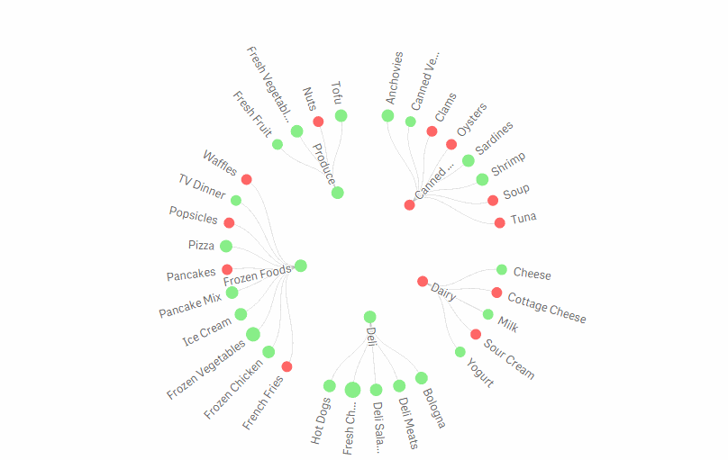
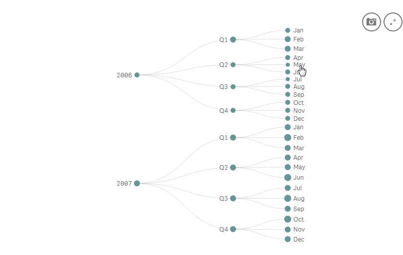

# Mekaarogram

A Qlik Sense extension used to display hierarchical structures from multiple dimensions.



## Usage

### Property settings

#### Data

##### Dimensions

The dimensions controls the way the tree is built.
Works in the same way as a pivot table with all dimensions under the row section.

###### Color

Sets the color of each bubble.

###### Emoticon

A symbol to show inside each bubble:

- Single letter

  Any single letter you can think of: `'S'`, `'$'`, `'汉'` ...

    

- Emoji

  A small set of emojis: `':)'`, `':|'`, `':('`, `':p'`, `':o'`, `';)'`

       

- Qlik icons

  Icons from the LUI icons set, prefix with `q-` followed by the ascii number representing the icon: `'q-33'`, `'q-239'` ...

   

- Material icons

  Icons from Google's [Materical Icons set](http://google.github.io/material-design-icons/#icon-font-for-the-web).

  Prefix with `m-` followed by the name: `'m-favorite'`, `'m-star'`, `'m-share'` ...

##### Measures

The values of the measure controls the size of each bubble.

###### Color

Same as for _Dimension_. The expression on the dimensions takes precedence.

###### Emoticon

Same as for _Dimension_. The expression on the dimensions takes precedence.

#### Appearance

##### Presentation

###### Bubble size

Controls the range in size on the bubbles.

###### Fully expanded

Controls if the tree should be fully expanded or allow users to expand/collapse each node separately (applicable only when 2 or more dimensions are used).

###### Dynamic link width
When selected, the link between nodes will adapt its width based on the size of the child node it links to (applicable only when 2 or more dimensions are used).

###### Radial

When selected, show a radial version of the tree.

### Interaction

#### Selection

Selection works just like in most of the Sense charts with an additional "linked selection" feature.



#### Collapse/expand nodes
When using multiple dimensions and property [Fully expanded](#fully-expanded) is disabled, nodes that can be expanded/collapsed will have a thick border.

Nodes can be expanded/collapsed by holding down SHIFT while clicking on the node.

On touch devices, simply swipe right/left to expand/collapse.

## Download

Go to [releases](https://github.com/miralemd/mekaarogram/releases) and download the file `mekaarogram-v<x.y.z>.zip` for the relevant release.

## Development

To create a production build:

```js
yarn run build
```

## License

MIT
